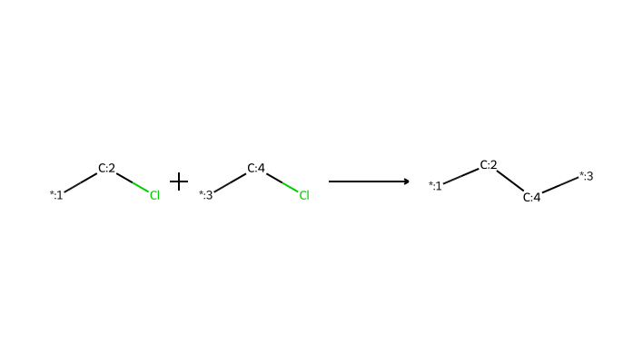
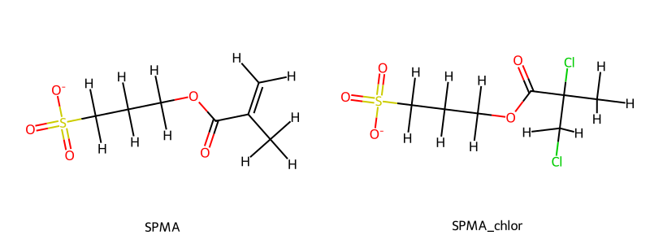

polyzymd_builder
==============================
[//]: # (Badges)

This repository is currently under development. To run the tutorial .ipynb notebooks, you first need to build the environment from the provided environment.yml file. After downloading this repository, create the environment with:

`mamba env create -f environment.yml`

and activate it with:

`mamba activate polyzymd-env`

## Important Notes

### Building Polymers from Monomers
* Monomers must be constructed in a way that is compliant with the reaction chemistry you wish to perform.
* For example, Atom-Transfer Radical Polymerization (ATRP) first requires activation of monomers via halogenating them.

* To perform this reaction, you must provide a **halogenated** monomer structure, in the example case a **chlorinated** one. 

### Copyright

Copyright (c) 2025, Joe Laforet Jr.

#### Acknowledgements
 
Project based on the 
[Computational Molecular Science Python Cookiecutter](https://github.com/molssi/cookiecutter-cms) version 1.11.
